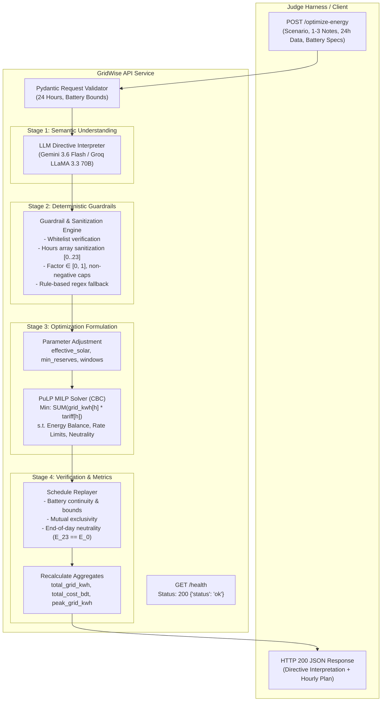

# GridWise LLM Challenge — Smart Campus Energy Optimizer

> BUP CSE Fest 2026 · Headless FastAPI service that interprets operator directives via LLM and produces a cost-optimal 24-hour energy dispatch plan using Mixed-Integer Linear Programming.

---

## How It Works



**LLM Cascade:** The service tries Google Gemini (`gemini-3.6-flash`) first, falls back to Groq (`llama-3.3-70b-versatile`), and finally uses a built-in regex/rule-based parser if both are unavailable. This guarantees the service works fully offline.

---

## Quickstart

```bash
# 1. Set up environment
uv venv .venv && source .venv/bin/activate
uv pip install -r requirements.txt

# 2. Configure API keys (optional — service works without them)
cp .env.example .env
# Edit .env with your GEMINI_API_KEY and/or GROQ_API_KEY

# 3. Run
python main.py
```

The server starts at `http://localhost:8000`.

---

## Environment Variables

| Variable | Description | Default |
| :--- | :--- | :--- |
| `GEMINI_API_KEY` | Google Gemini AI Studio key | *(optional)* |
| `GEMINI_MODEL` | Gemini model ID | `gemini-3.6-flash` |
| `GROQ_API_KEY` | Groq API key | *(optional)* |
| `GROQ_MODEL` | Groq model name | `llama-3.3-70b-versatile` |
| `PORT` | Server port | `8000` |
| `HOST` | Server host | `0.0.0.0` |

> If no API keys are set, the deterministic rule-based parser handles all directive interpretation automatically.

---

## API Reference

### `GET /health`

```json
{"status": "ok"}
```

### `POST /optimize-energy`

**Request body:**

| Field | Type | Description |
| :--- | :--- | :--- |
| `scenario_id` | `string` | Scenario identifier |
| `operator_notes` | `string[]` (1-3) | Natural-language operator directives |
| `hours` | `HourEntry[]` (24) | Hourly demand, solar, and tariff data |
| `battery` | `BatteryConfig` | Capacity, initial energy, min energy, charge/discharge rates |

**Supported directive types:**

| Directive | Structured Adjustment |
| :--- | :--- |
| `solar_reduction` | `{"hours": [...], "factor": float}` |
| `minimum_battery_reserve` | `{"hours": [...], "minimum_energy_kwh": float}` |
| `no_charge_window` | `{"hours": [...]}` |
| `no_discharge_window` | `{"hours": [...]}` |
| `max_grid_window` | `{"hours": [...], "max_grid_kwh": float}` |
| `no_op` | `null` (distractor note) |

**Response:** Returns `scenario_id`, `directive_interpretation[]`, `hourly_plan[]` (24 entries), `total_grid_kwh`, `total_cost_bdt`, `peak_grid_kwh`, and `plan_summary`.

<details>
<summary>Example cURL</summary>

```bash
curl -X POST http://localhost:8000/optimize-energy \
  -H "Content-Type: application/json" \
  -d '{
    "scenario_id": "GRID-SCENARIO-2026-01",
    "operator_notes": [
      "Solar output will drop to about 20% from 1 PM to 3 PM.",
      "Do not charge the battery between 2 PM and 4 PM.",
      "The cafeteria menu changes tomorrow."
    ],
    "hours": [
      {"hour": 0, "demand_kwh": 180, "solar_kwh": 0, "tariff_bdt_per_kwh": 6.5},
      {"hour": 1, "demand_kwh": 180, "solar_kwh": 0, "tariff_bdt_per_kwh": 6.5},
      {"hour": 2, "demand_kwh": 180, "solar_kwh": 0, "tariff_bdt_per_kwh": 6.5},
      {"hour": 3, "demand_kwh": 180, "solar_kwh": 0, "tariff_bdt_per_kwh": 6.5},
      {"hour": 4, "demand_kwh": 180, "solar_kwh": 0, "tariff_bdt_per_kwh": 6.5},
      {"hour": 5, "demand_kwh": 180, "solar_kwh": 0, "tariff_bdt_per_kwh": 6.5},
      {"hour": 6, "demand_kwh": 180, "solar_kwh": 50, "tariff_bdt_per_kwh": 8.5},
      {"hour": 7, "demand_kwh": 180, "solar_kwh": 100, "tariff_bdt_per_kwh": 8.5},
      {"hour": 8, "demand_kwh": 350, "solar_kwh": 150, "tariff_bdt_per_kwh": 8.5},
      {"hour": 9, "demand_kwh": 350, "solar_kwh": 200, "tariff_bdt_per_kwh": 8.5},
      {"hour": 10, "demand_kwh": 350, "solar_kwh": 250, "tariff_bdt_per_kwh": 8.5},
      {"hour": 11, "demand_kwh": 350, "solar_kwh": 300, "tariff_bdt_per_kwh": 8.5},
      {"hour": 12, "demand_kwh": 350, "solar_kwh": 350, "tariff_bdt_per_kwh": 8.5},
      {"hour": 13, "demand_kwh": 350, "solar_kwh": 300, "tariff_bdt_per_kwh": 8.5},
      {"hour": 14, "demand_kwh": 350, "solar_kwh": 250, "tariff_bdt_per_kwh": 8.5},
      {"hour": 15, "demand_kwh": 350, "solar_kwh": 200, "tariff_bdt_per_kwh": 8.5},
      {"hour": 16, "demand_kwh": 350, "solar_kwh": 150, "tariff_bdt_per_kwh": 8.5},
      {"hour": 17, "demand_kwh": 350, "solar_kwh": 100, "tariff_bdt_per_kwh": 12.0},
      {"hour": 18, "demand_kwh": 350, "solar_kwh": 50, "tariff_bdt_per_kwh": 12.0},
      {"hour": 19, "demand_kwh": 350, "solar_kwh": 0, "tariff_bdt_per_kwh": 12.0},
      {"hour": 20, "demand_kwh": 350, "solar_kwh": 0, "tariff_bdt_per_kwh": 12.0},
      {"hour": 21, "demand_kwh": 180, "solar_kwh": 0, "tariff_bdt_per_kwh": 12.0},
      {"hour": 22, "demand_kwh": 180, "solar_kwh": 0, "tariff_bdt_per_kwh": 12.0},
      {"hour": 23, "demand_kwh": 180, "solar_kwh": 0, "tariff_bdt_per_kwh": 6.5}
    ],
    "battery": {
      "capacity_kwh": 500,
      "initial_energy_kwh": 200,
      "minimum_energy_kwh": 50,
      "max_charge_kwh_per_hour": 100,
      "max_discharge_kwh_per_hour": 100
    }
  }'
```

</details>

---

## Testing

```bash
pytest -v
```

Covers: health check, time-window parsing, guardrail validation, full end-to-end optimization, battery/energy balance replay, paraphrased note variations, and malformed-request handling.

---

## Docker

```bash
docker build -t bup-gridwise-api .
docker run -d -p 8000:8000 -e GEMINI_API_KEY="your_key" bup-gridwise-api
curl http://localhost:8000/health
```

---

## Project Structure

```
├── main.py                 # FastAPI entrypoint
├── core/config.py          # Settings & env loader
├── models/
│   ├── request.py          # Pydantic input validation
│   └── response.py         # Response schemas
├── services/
│   ├── llm_client.py       # Multi-tier LLM engine (Gemini → Groq → regex)
│   └── optimizer.py        # MILP solver + schedule replayer
├── utils/guardrails.py     # Guardrails, sanitization, rule-based fallback
├── tests/                  # pytest test suites
├── docs/                   # Architecture, API ref, ADRs, security audit
├── Dockerfile
├── requirements.txt
└── .env.example
```

---

## Security

- API keys are loaded exclusively from environment variables and never logged or serialized in responses.
- Global exception handler suppresses stack traces — clients only see generic error messages.
- HTTP security headers: `X-Content-Type-Options`, `X-Frame-Options`, `X-XSS-Protection`, CORS.
- LLM outputs are treated as untrusted data — all results pass through deterministic guardrails before reaching the solver.