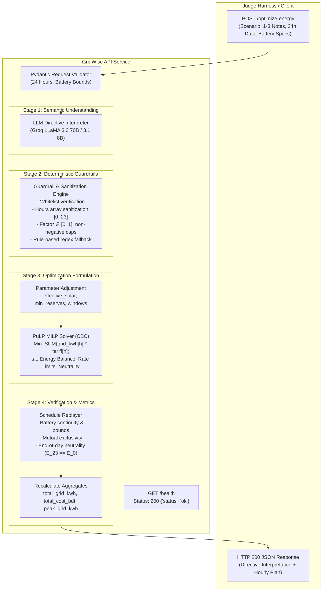

# BUP CSE Fest 2026: GridWise LLM Challenge Solution
## Smart Campus Energy Optimization Service

A production-grade, headless FastAPI REST service combining **LLM-assisted operator directive interpretation**, **deterministic guardrails & sanitization**, and **Mixed-Integer Linear Programming (MILP) energy scheduling** over a 24-hour planning horizon ($h = 0 \dots 23$).

---

## 🏗️ Architecture & Pipeline Overview

The service strictly adheres to the 5-stage deterministic and AI flow specified in the challenge guidelines:



### 1. LLM Role & Semantic Interpretation
- Campus operator notes are natural-language strings (1–3 per scenario).
- The service uses **Google Gemini AI Studio** (`gemini-3.6-flash`) as its primary generative engine via the official `google-genai` SDK with native structured JSON output.
- Multi-tier cascading architecture:
  1. **Google Gemini AI Studio** (`gemini-3.6-flash`, primary)
  2. **Groq** (`llama-3.3-70b-versatile`, secondary)
  3. **Deterministic Rule-Based Parser** (offline fail-safe)
- Supported directives:
  - `solar_reduction`: `{"hours": [int, ...], "factor": float}`
  - `minimum_battery_reserve`: `{"hours": [int, ...], "minimum_energy_kwh": float}`
  - `no_charge_window`: `{"hours": [int, ...]}`
  - `no_discharge_window`: `{"hours": [int, ...]}`
  - `max_grid_window`: `{"hours": [int, ...], "max_grid_kwh": float}`
  - `no_op`: Irrelevant distractor note (`applies: false`, `structured_adjustment: null`).

### 2. Deterministic Guardrails & Fallback
- Raw LLM outputs are treated as untrusted.
- Guardrails validate types, enforce sorted and unique hour arrays ($[start, end)$ intervals), clamp solar factors between 0 and 1, and ensure battery reserve limits do not exceed battery capacity.
- **Safe Failure & Offline Fallback**: If `GEMINI_API_KEY` is omitted or an API error occurs, the system cascades automatically to Groq or the embedded rule-based semantic parser without failure.

### 3. Optimization & Linear Programming
- Formulated using **PuLP** with the **CBC** branch-and-cut solver.
- Binary variables guarantee **action mutual exclusivity** (a battery cannot charge and discharge simultaneously in the same hour).
- Enforces **hourly energy balance**: $\text{grid}_h + \text{solar\_used}_h + \text{discharge}_h = \text{demand}_h + \text{charge}_h$.
- Enforces **end-of-day battery neutrality**: $E_{\text{after}}[23] = E_{\text{initial}}$.

---

## ⚙️ Environment Variables

Configuration is loaded from `.env` in the project root:

| Variable | Description | Default |
| :--- | :--- | :--- |
| `GEMINI_API_KEY` | Google Gemini AI Studio API Key | *(Optional, falls back to Groq or rule-based parser)* |
| `GEMINI_MODEL` | Google Gemini Model ID | `gemini-3.6-flash` |
| `GROQ_API_KEY` | Groq API Key (Secondary alternative) | *(Optional)* |
| `GROQ_MODEL` | Groq Model Name | `llama-3.3-70b-versatile` |
| `PORT` | HTTP Service Port | `8000` |
| `HOST` | HTTP Service Host Binding | `0.0.0.0` |

---

## 🚀 Quickstart & Local Setup

### 1. Activate Environment
A pre-configured virtual environment is located in `.venv`:
```bash
# Linux / macOS (Bash/Zsh)
source .venv/bin/activate

# Fish Shell
source .venv/bin/activate.fish
```

*(To recreate the environment if needed)*:
```bash
uv venv .venv
source .venv/bin/activate
uv pip install -r requirements.txt
```

### 2. Configure Environment
```bash
cp .env.example .env
# Edit .env and insert your GROQ_API_KEY if testing with live LLM
```

### 3. Run the Server
```bash
# Using uvicorn with auto-reload (development mode):
uvicorn main:app --reload --host 0.0.0.0 --port 8000

# Or directly with Python:
python main.py

# Or via uv without activating:
uv run uvicorn main:app --host 0.0.0.0 --port 8000
```

---

## 🧪 Testing & Verification

Run the test suite with `pytest`:
```bash
pytest -v
```

All 7 test suites verify:
- Health check readiness (`GET /health`)
- Time window interval parsing ($[start, end)$ semantics)
- Guardrail validation and sanitization
- Full end-to-end optimization pipeline with 24-hour dispatch
- Physical, battery, and energy balance replay checks
- Paraphrased operator notes variations
- 400 Bad Request handling on malformed payloads

---

## 📡 API Usage & Sample cURL Calls

### Health Check (`GET /health`)
```bash
curl -s http://localhost:8000/health
```
**Response:**
```json
{"status": "ok"}
```

### Energy Optimization (`POST /optimize-energy`)
```bash
curl -X POST http://localhost:8000/optimize-energy \
  -H "Content-Type: application/json" \
  -d '{
    "scenario_id": "GRID-SCENARIO-2026-01",
    "operator_notes": [
      "Solar output will drop to about 20% from 1 PM to 3 PM.",
      "Do not charge the battery between 2 PM and 4 PM.",
      "The cafeteria menu changes tomorrow."
    ],
    "hours": [
      {"hour": 0, "demand_kwh": 180.0, "solar_kwh": 0.0, "tariff_bdt_per_kwh": 6.5},
      {"hour": 1, "demand_kwh": 180.0, "solar_kwh": 0.0, "tariff_bdt_per_kwh": 6.5},
      {"hour": 2, "demand_kwh": 180.0, "solar_kwh": 0.0, "tariff_bdt_per_kwh": 6.5},
      {"hour": 3, "demand_kwh": 180.0, "solar_kwh": 0.0, "tariff_bdt_per_kwh": 6.5},
      {"hour": 4, "demand_kwh": 180.0, "solar_kwh": 0.0, "tariff_bdt_per_kwh": 6.5},
      {"hour": 5, "demand_kwh": 180.0, "solar_kwh": 0.0, "tariff_bdt_per_kwh": 6.5},
      {"hour": 6, "demand_kwh": 180.0, "solar_kwh": 50.0, "tariff_bdt_per_kwh": 8.5},
      {"hour": 7, "demand_kwh": 180.0, "solar_kwh": 100.0, "tariff_bdt_per_kwh": 8.5},
      {"hour": 8, "demand_kwh": 350.0, "solar_kwh": 150.0, "tariff_bdt_per_kwh": 8.5},
      {"hour": 9, "demand_kwh": 350.0, "solar_kwh": 200.0, "tariff_bdt_per_kwh": 8.5},
      {"hour": 10, "demand_kwh": 350.0, "solar_kwh": 250.0, "tariff_bdt_per_kwh": 8.5},
      {"hour": 11, "demand_kwh": 350.0, "solar_kwh": 300.0, "tariff_bdt_per_kwh": 8.5},
      {"hour": 12, "demand_kwh": 350.0, "solar_kwh": 350.0, "tariff_bdt_per_kwh": 8.5},
      {"hour": 13, "demand_kwh": 350.0, "solar_kwh": 300.0, "tariff_bdt_per_kwh": 8.5},
      {"hour": 14, "demand_kwh": 350.0, "solar_kwh": 250.0, "tariff_bdt_per_kwh": 8.5},
      {"hour": 15, "demand_kwh": 350.0, "solar_kwh": 200.0, "tariff_bdt_per_kwh": 8.5},
      {"hour": 16, "demand_kwh": 350.0, "solar_kwh": 150.0, "tariff_bdt_per_kwh": 8.5},
      {"hour": 17, "demand_kwh": 350.0, "solar_kwh": 100.0, "tariff_bdt_per_kwh": 12.0},
      {"hour": 18, "demand_kwh": 350.0, "solar_kwh": 50.0, "tariff_bdt_per_kwh": 12.0},
      {"hour": 19, "demand_kwh": 350.0, "solar_kwh": 0.0, "tariff_bdt_per_kwh": 12.0},
      {"hour": 20, "demand_kwh": 350.0, "solar_kwh": 0.0, "tariff_bdt_per_kwh": 12.0},
      {"hour": 21, "demand_kwh": 180.0, "solar_kwh": 0.0, "tariff_bdt_per_kwh": 12.0},
      {"hour": 22, "demand_kwh": 180.0, "solar_kwh": 0.0, "tariff_bdt_per_kwh": 12.0},
      {"hour": 23, "demand_kwh": 180.0, "solar_kwh": 0.0, "tariff_bdt_per_kwh": 6.5}
    ],
    "battery": {
      "capacity_kwh": 500.0,
      "initial_energy_kwh": 200.0,
      "minimum_energy_kwh": 50.0,
      "max_charge_kwh_per_hour": 100.0,
      "max_discharge_kwh_per_hour": 100.0
    }
  }'
```

---

## 🐳 Docker Deployment (Fallback Image)

Build and run the container locally:
```bash
# 1. Build image
docker build -t bup-gridwise-api:latest .

# 2. Run container (binding to 0.0.0.0 on port 8000)
docker run -d -p 8000:8000 \
  -e GROQ_API_KEY="your_key_here" \
  --name gridwise-api \
  bup-gridwise-api:latest

# 3. Test readiness
curl http://localhost:8000/health
```

---

## 📁 Repository Structure

```text
├── core/
│   ├── __init__.py
│   └── config.py           # Application settings & environment loader
├── models/
│   ├── __init__.py
│   ├── request.py          # Strict Pydantic models for input validation
│   └── response.py         # Schema models for directive & hourly plans
├── services/
│   ├── __init__.py
│   ├── groq_client.py      # LLM directive extractor with Groq
│   └── optimizer.py        # PuLP Mixed-Integer Linear Programming solver
├── utils/
│   ├── __init__.py
│   └── guardrails.py       # Time parser, guardrails, and fallback NLP engine
├── tests/
│   ├── __init__.py
│   ├── test_health.py      # Readiness health check test
│   └── test_optimizer.py   # Comprehensive optimization and directive tests
├── .dockerignore
├── .env.example            # Environment configuration template
├── .gitignore
├── Dockerfile              # Containerization definition
├── main.py                 # FastAPI application entrypoint
├── requirements.txt        # Python dependency manifest
└── README.md               # Quickstart and architectural documentation
```