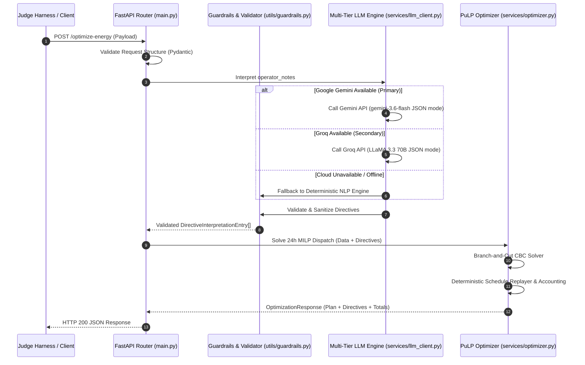

# Technical Architecture & Pipeline Specification

## 1. System Overview

The **Campus Energy Optimization API** is a headless service designed for the BUP CSE Fest 2026 GridWise LLM Challenge. It solves the 24-hour campus energy scheduling problem by orchestrating generative AI for semantic understanding and deterministic mathematical optimization for cost minimization.

---

## 2. Pipeline Stages

### Stage 1: Request Ingestion & Semantic Parsing
- **Endpoint:** `POST /optimize-energy`
- **Schema Validation:** Enforces 24 unique, sorted hours (0–23), non-empty operator notes (1–3), and physically valid battery bounds via Pydantic v2.
- **Model Invocation:** Notes are formatted into a structured prompt with few-shot examples and sent to **Google Gemini AI Studio** (`gemini-3.6-flash`) using the official `google-genai` SDK with native JSON mode (`response_mime_type="application/json"`). If unavailable, the system cascades to Groq (`llama-3.3-70b-versatile`) or the deterministic rule-based parser.

### Stage 2: Guardrail & Sanitization Engine
The raw output of the LLM is intercepted and sanitized:
- **Type Checking:** Maps `directive_type` against `ALLOWED_DIRECTIVE_TYPES`.
- **Interval Normalization:** Normalizes time references into $[start, end)$ ascending arrays of unique integers.
- **Value Bounds:** 
  - Solar reduction: $factor \in [0.0, 1.0]$.
  - Minimum reserve: $minimum\_energy\_kwh \le capacity\_kwh$.
  - Grid cap: $max\_grid\_kwh \ge 0.0$.
- **Semantics:** Ensures `applies == false` and `structured_adjustment == null` for `no_op`.

### Stage 3: Optimization Formulation
- Modifies effective solar availability ($solar \times factor$).
- Elevates dynamic minimum battery reserves.
- Applies charging and discharging restriction windows.
- Injects grid import constraints.
- Formulates mixed-integer linear programming (MILP) equations in PuLP.

### Stage 4: Schedule Replay & Verification
Before serializing the API response:
- Simulates hour-by-hour battery state transitions.
- Verifies mutual exclusivity: only one of `charge`, `discharge`, or `idle` is active per hour.
- Verifies physical energy balance: $\text{grid} + \text{solar\_used} + \text{discharge} = \text{demand} + \text{charge}$.
- Recalculates `total_grid_kwh`, `total_cost_bdt`, and `peak_grid_kwh` with two-decimal precision.

---

## 3. Error Handling & Security Model

1. **Structured 400 Bad Request:** 
   Triggered on malformed JSON, missing top-level fields, or invalid hour lengths. Returns sanitized validation errors.
2. **Controlled 500 Internal Server Error:** 
   Prevents leaking internal stack traces, system paths, or environment variables to external clients.
3. **Secret Protection:** 
   API keys (`GROQ_API_KEY`) are managed strictly via environment variables and never logged or serialized in error messages or responses.
